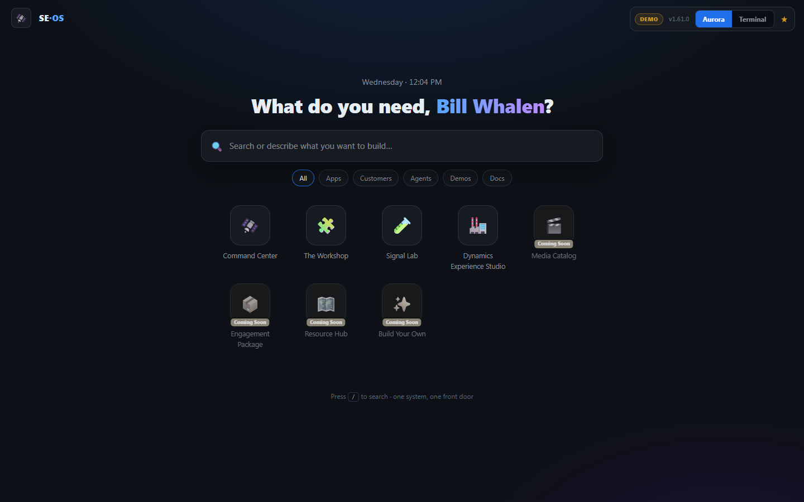

# SE OS — The SE Operating System

> A turnkey platform that turns a Microsoft Sales Engineer's work into a **flywheel**: every engagement is delivered faster than the last, because every engagement deposits reusable skills, assets, and patterns back into a shared library.

[](https://github.com/billwhalenmsft/se-os-template/generate)

> 🌐 **See the vision:** [billwhalenmsft.github.io/se-os-overview](https://billwhalenmsft.github.io/se-os-overview/) — the leadership view
> 📖 **Start here:** [The SE Reinvention Manifesto](./MANIFESTO.md) — why this exists and the measurable promise
> 📅 **See it in action:** [A Day in the Life — reinvented](./web_ui/day-in-the-life.html)



> *The Launcher — "what do you need?" One front door to every module. [See more views →](https://billwhalenmsft.github.io/se-os-overview/#see)*

---

## The flywheel

SE OS is built on one idea: **the work should compound.** Most SE effort evaporates — a demo built for one customer dies in a OneDrive, the next SE starts from zero. SE OS captures the output of every engagement and feeds it forward, so the platform gets *faster and smarter the more it's used.*

```
        ┌──────────────────────────────────────────────────────┐
        │                                                      ▼
   ① SIGNAL ──▶ ② FRAME ──▶ ③ BUILD ──▶ ④ DELIVER ──▶ ⑤ HARVEST
   a use case   outcome +    digital SE   scripted demo   skills, assets,
   arrives      KPI first    team builds  + leave-behind  patterns → library
        ▲                                                      │
        │              ⑥ COMPOUND — the library grows,         │
        └──────────────  the next engagement starts ahead ◀────┘
                         (value tracked to an MSX milestone)
```

| # | Station | What happens | Powered by |
|---|---------|--------------|------------|
| ① | **Signal** | A use case, ask, or meeting note arrives | Signal Router (WorkIQ · meetings · inbox · MSX) |
| ② | **Frame** | Business problem + success criteria + KPI defined **before any build** | Outcome Framer agent |
| ③ | **Build** | The digital SE team builds demos, prototypes, SOPs, architectures | ~25 specialist agents + guilds |
| ④ | **Deliver** | A scripted demo + an interactive leave-behind the customer can use | Demo Factory + Command Center |
| ⑤ | **Harvest** | Skills, assets, and patterns are promoted to the shared library | CoE in a Box |
| ⑥ | **Compound** | The next engagement starts further ahead; value ties to an MSX milestone | Engagement Catalog + MSX |

**Harvest is the flywheel's flywheel.** The skills are the durable asset — pay the discovery cost once, distribute the result. One deploy, many SEs, a library that only grows.

---

## What spins the flywheel

Three layers. One platform.

| Layer | Role in the flywheel |
|---|---|
| **🖥️ SE Command Center** | The cockpit — Signal in, Deliver out. Priorities, customer meetings, demo queue, team activity, AI assistant, all in one tab |
| **🧑‍💼 Digital SE Team** | The **Build** engine — ~25 AI personas in 4 neighborhoods that build demo assets, SOPs, and architectures autonomously between your meetings |
| **🧠 Specialist Cloud Agents** | Deep technical workers the generalists call ([example](https://github.com/promptclickrun/power-agents-blueprint)). See [the specialist library](./agents/specialist-cloud-agents/) |
| **🏛️ CoE in a Box** | The **Harvest + Compound** mechanism — tracks, guild quality gates, and an issue-driven workflow so everything built becomes reusable knowledge |

---

## Why the flywheel beats the status quo

| Today (linear — work evaporates) | With SE OS (flywheel — work compounds) |
|---|---|
| New SE takes months to get demo-ready | Onboarded in under a day — inherits the whole library |
| Demo assets die in personal OneDrives | Harvested to a shared, searchable, auto-updated library |
| SOPs don't exist or are always stale | Generated from conversation patterns, refreshed on every turn |
| 2–3 hrs prep per meeting | 15-min AI-assisted prep — the team prepped while you slept |
| Each SE rebuilds the same tools | Build once, every SE reuses it; the next build starts ahead |

---

## What you get out of the box

The moment you generate your repo, you inherit a working system — not an empty scaffold:

| You get | What it is |
|---|---|
| 🖥️ **A deployable Command Center** | The SE-OS SPA — Launcher, Workshop, Signal Lab — runs locally with no build step |
| 🧑‍💼 **~25 specialist agents** | The digital SE team, pre-wired as an outcome-first pipeline on GitHub Actions |
| 🗂️ **Practice tracks** | Solution-area × vertical tracks (Discrete/Process Mfg, Mobility, Distribution) with charters, use-cases, talk-tracks |
| 🎬 **A demo library** | 31+ ready-to-use customer demo guides |
| 🧠 **Knowledge-base templates** | Context-card starters so your environment knowledge is captured, not lost |
| 🛠️ **The spin-up wizard** | One script provisions Azure + registers your workspace on the SE-OS network |
| 📋 **Issue templates + CI** | Feature / demo / SOP request inboxes and auto-deploy wired in |

---

## Quick Start (15 minutes)

### Prerequisites
- GitHub account (Microsoft EMU: `@microsoft.com`)
- Azure subscription with Static Web Apps quota
- Azure CLI installed

### 1. Use this template
Click **["Use this template"](https://github.com/billwhalenmsft/se-os-template/generate)** → create your own `se-os` repo.

### 2. Configure
```bash
cp setup/config.template.json setup.config.json
# Edit setup.config.json with your SE details (gitignored — safe for org URLs/aliases)
```

### 3. Run the spin-up wizard
```powershell
# Windows
.\setup\hatch.ps1

# Mac / Linux
./setup/hatch.sh
```

The wizard provisions your Azure resources **and registers your workspace with the SE-OS network** (a non-sensitive manifest — alias, practice, hub URL, resource names; never secrets or org URLs) so the fleet is visible centrally.

### 4. Deploy
Push to `main` → GitHub Actions deploys to Azure Static Web Apps automatically.

Your SE Command Center is live at `https://[your-alias]-se-os.azurestaticapps.net`.

---

## Repository structure

```
se-os/
├── web_ui/              # SE Command Center SPA (open index.html locally to preview)
│   ├── index.html       # The dashboard — no build step required
│   ├── demos/           # Customer demo guides library (31+ ready-to-use scripts)
│   └── staticwebapp.config.json
├── agents/              # Digital SE Team (the Build engine)
│   ├── personas/        # Soul cards for the SE personas
│   ├── guilds/          # Quality standards (AI Craft, Demo Excellence, Customer Empathy)
│   └── *.py             # Agent implementations (Azure Functions compatible)
├── knowledge_base/      # Your SE knowledge (context cards, use cases, SOPs) — the Harvest store
│   └── _templates/      # Starter templates for new context cards
├── tracks/              # Practice area tracks (Discrete Mfg, Process Mfg, etc.)
├── decisions/           # Decision log — what was built, why, what changed
├── setup/               # Spin-up wizard + workspace registration
├── docs/                # Architecture, deployment, digital SE team guide
└── .github/
    ├── ISSUE_TEMPLATE/  # Feature requests, demo requests, SOP requests (Signal in)
    └── workflows/       # Azure SWA auto-deploy
```

---

## The Digital SE Team (the Build engine)

These are not tools you use. They are team members you work with — an **outcome-first** pipeline where nothing is "done" until it's validated against the business problem and KPI it was framed with.

| Persona | Role | Flywheel station |
|---|---|---|
| Maya Chen | Program Manager | routes work, runs the pipeline, weekly digest |
| Felix Vance | Outcome Framer | maps everything to a business outcome + KPI (**②**) |
| Priya Nair | Industry SME | SOPs, process docs, use-case definitions |
| Diego Santos | Architect | solution patterns, integration design |
| Sam Okafor | Developer | agent code, config scripts, RAPP artifacts |
| Iris Park | AI Specialist | eval rigor, prompt quality, model selection |
| Theo Larkin | UX Designer | demo flows, user stories, experience design |
| Rowan Hayes | QA Engineer | edge cases, quality gates, regression coverage |
| Naomi Wells | Security Reviewer | the "no" — with reasons |
| Jonas Reid | Content Strategist | demo narratives, SOPs, customer-facing docs |
| Aria Kapoor | Data Analyst | metrics, benchmarks, impact measurement |
| Vera Holm | Customer Persona | channels buyer reactions in voice |

**Three guilds enforce quality** so the harvest is worth keeping:
- 🛠️ **AI Craft** — eval rigor, prompt hygiene, model selection
- 🎬 **Demo Excellence** — five-beat narrative, customer-ready polish
- 🤝 **Customer Empathy** — customer voice, persona accuracy, industry authenticity

**Four neighborhoods organize the team** ([details](./agents/neighborhoods/)):

| 🤝 Customer-Facing | 🛠️ Build-Time | ✅ Quality | 🧭 Strategy |
|---|---|---|---|
| Vera · Priya · Jonas · Felix | Sam · Theo · Diego · Iris | Rowan · Naomi | Maya · Aria |

---

## How SEs get skilled — Tracks · Neighborhoods · Guilds

SE-OS treats skilling as **architecture, not after-the-fact training.** You don't assemble your setup — you inherit a profile composed for your role, track, and vertical on day one. Three axes do it:

| Axis | What it is | Why it matters |
|---|---|---|
| 🗂️ **Tracks** — *what you're skilled for* | Organized like we sell: solution area (AI Business Process · AI Workplace · Cloud & AI Platforms · Security) × vertical (Discrete / Process Mfg · Mobility · Distribution). Each ships pre-loaded with charter, use-cases, talk-tracks, demos. | Pick your track → inherit the domain on **day one, not month three**. ([tracks/](./tracks/)) |
| 🏘️ **Neighborhoods** — *how the team organizes* | The agents cluster into 4 neighborhoods: Customer-Facing · Build-Time · Quality · Strategy. | Routing is automatic — issue type → neighborhood → right persona. ([neighborhoods/](./agents/neighborhoods/)) |
| 🛡️ **Guilds** — *the craft bar across tracks* | Horizontal communities of practice: **AI Craft** (eval rigor, prompts, model selection), **Demo Excellence** (narrative, polish), **Customer Empathy** (outcome framing). | A guild **review gate** ratchets the quality bar up once and applies it everywhere — no drift. ([guilds/](./agents/guilds/)) |

> **The up-front mechanism:** `Role + Track → a per-SE profile` that pre-composes your **agent mix + guild standards + track context + tooling (skills · MCP · environments)**. As you deliver, your work harvests back into the shared library — so the next SE in your role starts further ahead. **Skilling compounds; it doesn't reset per hire.**

---

## How customer work is organized

Every engagement lives in its own folder — browseable, snapshot-deployable, and the source of truth for that customer:

```
customers/<name>/
├── CONTEXT.md       # AI session memory — what this customer is about
├── .project.yml     # phase, signals[], MSX milestone (ties work to a real outcome)
├── demo-build/      # the cockpit, scripts, leave-behind
└── knowledge_base/  # environment context cards the agents read first
```

Work flows **Signal → Triage → Engage → Build → Deliver → Harvest → Value** — a signal arrives (meeting, inbox, M365), the router opens or advances the right customer project, the team builds, and value ties back to an MSX milestone.

---

## Tokenomics — scale the output, not the spend

One SE at full throttle this year took **2+ billion tokens a month** — but that's the **one-time cost of *discovering* the patterns**, not the cost of *operating* SE-OS. The platform turns that spend into a durable, distributable library so every SE inherits the output without re-paying the bill: **skills not re-derivation · a model cost ladder (small models for routine work) · curated memory · deterministic work where possible · estimate-before-you-spend · one deploy, many SEs.**

**Pay the discovery cost once, distribute the result.** → [Full tokenomics breakdown](https://billwhalenmsft.github.io/se-os-overview/#tokenomics)

---

## How a turn of the flywheel works

1. A **Signal** arrives — you (or the orchestrator) file a GitHub issue
2. The **Outcome Framer** pins the business problem + KPI before any build
3. The right agent **Builds** the artifact, posts results; when a real call is needed it posts a 3-option decision brief and flags `needs-se-input`
4. You **Deliver** to the customer; everything else, the engine runs
5. The artifact is **Harvested** into the shared library — the next turn starts ahead

The agents do the work between your customer meetings. The library does the compounding.

---

## Two deployment modes

| Mode | Best for |
|---|---|
| **Your own instance** (template) | Individual SE — private copy with your environments and customers |
| **Shared team deployment** | SE team or practice lead — one deployment, all SEs connect with their own identity |

See `docs/DEPLOYMENT.md`.

---

## Your data & identity stay yours

SE-OS is built so you can adopt it without handing anything over:

- **You own your repo.** Generated from the template into your account — your customers, your environments, your context.
- **Secrets never live in the repo.** Credentials go to Azure config / a vault by reference; `setup.config.json` is gitignored.
- **Central visibility is non-sensitive by design.** When you deploy, your workspace registers on the SE-OS network with a **names-only manifest** (alias, practice, hub URL, resource names) — **never** subscription IDs, tenant IDs, org URLs, or secrets. The fleet can see *that* you onboarded and *where your hub is* — nothing about your customers.
- **Sign-in reads only your profile.** The Command Center uses your `@microsoft.com` identity to personalize — it doesn't change anything in your account.

---

## Practice areas (seed the flywheel for your domain)

SE OS ships with **Discrete Manufacturing** as the baseline. To add your own:

1. Duplicate `tracks/discrete-mfg/` → `tracks/[your-practice]/`
2. Update `knowledge_base/` with your environment context cards
3. Update `web_ui/resource-hub-data.json` to surface your content

---

## Built on

- **Azure Static Web Apps** — zero-config hosting, GitHub auth built in
- **RAPP pipeline** (optional) — transcript → agent → deployed demo in one step ([CommunityRAPP](https://github.com/kody-w/CommunityRAPP))
- **Azure Functions** (optional) — backend API for the Digital SE Team
- **GitHub Issues** — the agent inbox and feature backlog (Signal in)
- **MCAPS-IQ** — the broader Microsoft SE tooling ecosystem ([repo](https://github.com/microsoft/MCAPS-IQ))

---

## The measurable promise

The flywheel only matters if it moves numbers. SE OS instruments the Command Center to track them — see [Time-Back Metric methodology](./docs/TIME_BACK_METRIC.md) and the [live report template](./web_ui/time-back.html).

| Metric | 60-day target |
|---|---|
| Prep time per customer meeting | **−60%** |
| Time available for customer conversation | **+40%** |
| Demo assets reused across SE team | **5×** |
| New SE time to productivity | **<1 week** |

If SE OS doesn't deliver these numbers, it's a failed experiment.

---

## FAQ

**Is this only for Discrete Manufacturing?**
No. Discrete Mfg is the seeded baseline; the track structure (solution area × vertical) is built to add your own practice — duplicate a track, drop in your context cards.

**Do I need the agent backend running to get value?**
No. The Command Center SPA is useful standalone (no build step, open `index.html`). The Digital SE Team (Azure Functions + GitHub Actions) is the autonomous layer you add when you want work to run between meetings.

**Will this touch my customers' environments?**
Only what *you* connect, by reference. SE-OS holds the *recipe*; data lives in your D365 org. No credentials in the repo.

**I'm a practice lead, not an individual SE — can my team share one?**
Yes — see [Two deployment modes](#two-deployment-modes). One shared deployment, every SE connects with their own identity.

**How do I steer the agents?**
File or comment on a GitHub issue. When a real decision is needed, the engine posts a 3-option brief and flags `needs-se-input` — it surfaces only the calls that need you.

---

> **SE OS is THE platform for Microsoft SEs.**
> Spin the flywheel — [use the template](https://github.com/billwhalenmsft/se-os-template/generate), or file an issue.
